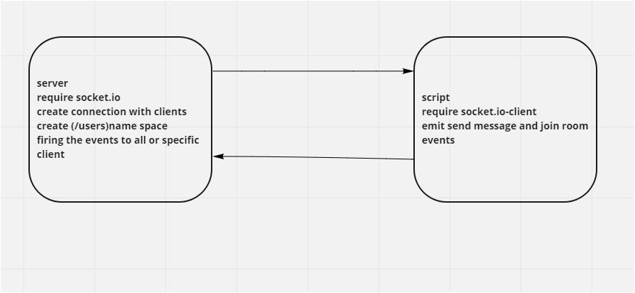

# messages app using socket.io
## descrption about what app does
This app allows users to send private or public messages and create chat rooms 

how i built this app
- Createed an html flie that contains a form which sends messages and joins to a room.
- i used socket.io to create server and socket.io-client to create client and connection btween them
- i installed this backages: socket.io, socket.io-client ,nodemon, snowpack,@socket.io/admin-ui  

[PR](https://github.com/idreesalmasri/messages-project-lab13/pull/2)

